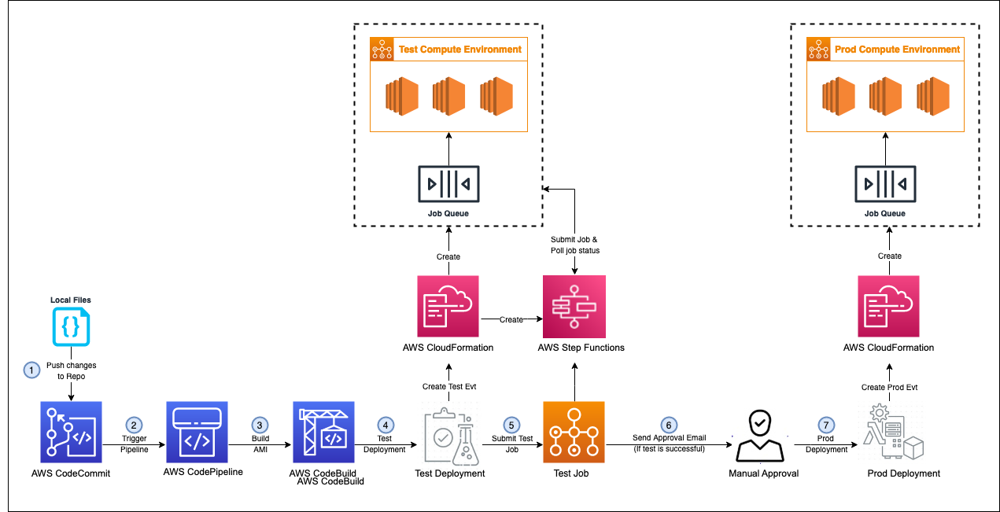
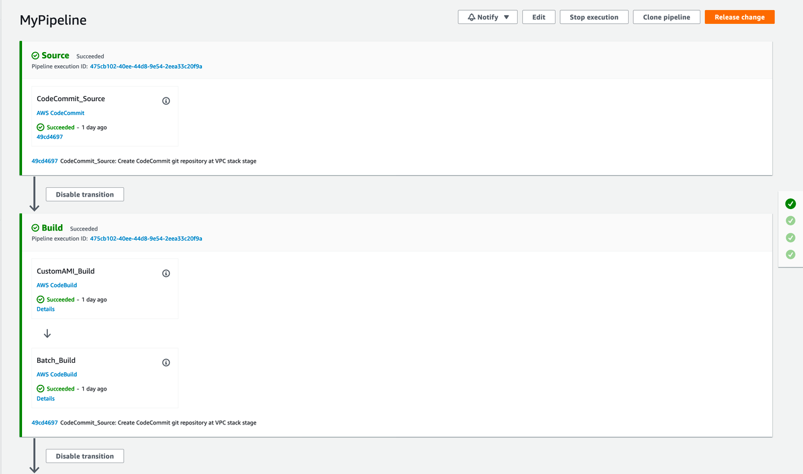
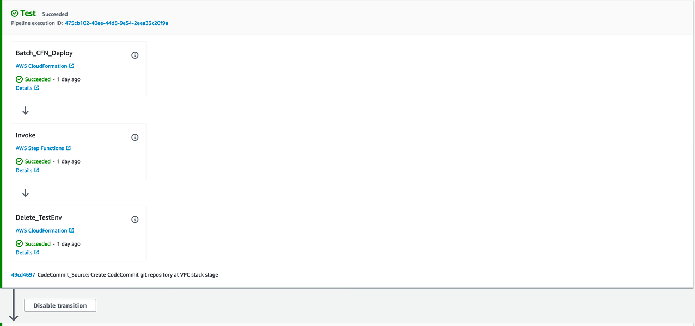
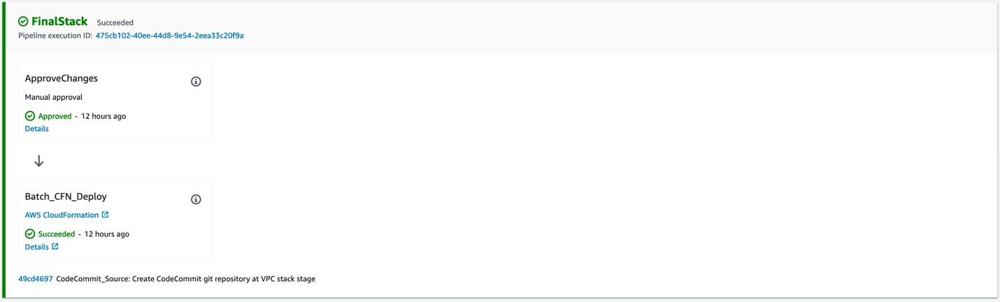

# Implementing an AWS CodePipeline to automate the Custom AMI creation for an AWS Batch Compute environment using an ephemeral environment


If you need to install a lot of software that isn't included in the standard AMIs for your jobs on AWS Batch, you can improve provisioning times by using a custom AMI for the compute environment. Having said that, the entire workflow for building a custom AMI can be a challenge to get right.

In this Solution, we will be using AWS CodePipeline to automate the Custom AMI creation for an AWS Batch Compute environment using the  Packer tool by HashiCorp and the pipeline will facilitate the creation of an ephermal test environment  before the production deployment. This cloud infrastructure is automated using AWS CDK.

[_AWS CodePipeline_](https://aws.amazon.com/codepipeline/) is a fully managed [_continuous delivery_](https://aws.amazon.com/devops/continuous-delivery/) service that helps you automate your release pipelines for fast and reliable application and infrastructure updates. CodePipeline automates the build, test, and deploy phases of your release process every time there is a code change, based on the release model you define.


The AWS Cloud Development Kit ([_AWS CDK_](https://aws.amazon.com/cdk/)) is an open-source software development framework to define your cloud application resources using familiar programming languages which will be used to define the infrastructure in our case. 


For a long time, Packer was the first make AMI in AWS. And it’s still a great tool what most people will choose to make AMI’s with. It’s free and open source and easy to use. The same building can be achieved with [_EC2 Image Builder_](https://aws.amazon.com/image-builder/) as well which has a pipeline approach to Image building. 

## `Solution Overview`

Figure 1. Architecture diagram of the workflow of the Deployment of the Custom Batch AMI

A custom AMI is build using HashiCorp packer. As shown in Figure 1, we  create an ephemeral AWS Batch Compute environment and will test the Custom Build AMI in this Batch Compute environment. If custom build passes the test, we will delete the test compute environment and pending Administrator or project owner approval we are going to update the Final Batch compute environment with the latest build AMI(Figure 1).


AWS CodePipeline will have the following stages and we will discuss these stages in more detail in coming sections. (Figure 1).

1. Source Stage (`AWS` `CodeCommit`)
2. Build Stage (`AWS` `CodeBuild`) - Build AMI using the HashiCorp packer package using AWS CodeBuild. Synthesize CDK code to generate Test and Final environment CloudFormation templates as output artifacts.
3. Test Deploy (`AWS` `CloudFormation`) - CodePipeline will create a Test Batch Compute Environment using CloudFormation and use AMI Built in previous stages. It will also create and update TestJobDefinition and TestJobQueue.
4. Test (`AWS` `StepFunction`) - CodePipeline will submit one test job in a test environment to check if the AMI was created successfully or not. StepFunction will Submit a Job using TestJobDefinition in TestJobQueue, which is configured with Batch Test Compute Environment created in the previous stage. StepFunction will keep checking the status of SubmitJob and update the CodePipeline status (Successful/Failed) accordingly.
5. Final Deploy
    1. Approval Stage: An Email will be sent to the approval list and CodePipeline will wait for the approval . Depending on the outcome, CodePipeline will either proceed or stop at this stage.
    2. Final Deploy(CloudFormation): If the deployment was approved in the previous stage, CodePipeline will go ahead and update the Batch Compute Environment with the latest build AMI.

Note: Make sure you don’t have any jobs running in the existing Batch compute environment as it will delete the current environment

# PREREQUISITES


Our pipeline will be connected to a source control repository, which after the first manual deploy of the pipeline, will trigger pipeline executions from that point forward.


### Clone the repository

```
cd batch-custom-ami-pipeline/
cd ~/environment
git clone [https://github.com/aws-samples/batch-custom-ami-pipeline](https://github.com/aws-samples/batch-custom-ami-pipeline)

```

### Update the variables

The following commands will update the variables ‘PIPELINE’, ‘MYSTATEMACHINE’, ‘[_abc@amazon.com_](mailto:abc@amazon.com)’. Please use the names you prefer.


```
sed -i -e 's/PIPELINE/batch-custom-ami-workshop/g' app.py
sed -i -e 's/MYSTATEMACHINE/myStateMachine/g' app.py
sed -i -e 's/abc@amazon.com/myemailid@mycompany.com/g' app.py
```

# Deployment

## Amazon CodeCommit

Create a source control repository to push our CDK infrastructure code.


```
aws codecommit create-repository --repository-name "batch-custom-ami-workshop" --repository-description "Batch Custom AMI Pipelines Workshop" --region [region-name]
```


At the terminal, run the following commands to configure the AWS CLI credential helper for HTTPS connections:` `


```
git config --global credential.helper '!aws codecommit credential-helper $@'
git config --global credential.UseHttpPath true
```


Add this to our project as an upstsream


```
git remote rm origin
git remote add origin [_https://git-codecommit.us-east-1.amazonaws.com/v1/repos/batch-custom-ami-workshop_](https://git-codecommit.us-east-1.amazonaws.com/v1/repos/batch-custom-ami-workshop)
```


Push our application to the repo


```
git checkout -b main
git add -A
git commit -am 'Initial application commit'
git push --set-upstream origin main
```


Install and setup prerequisites


```
sudo yum -y install nodejs python3
```

# Setup a CDK project

## Install the latest CDK` `

If you are using Cloud9, the CDK is already pre-installed but it will likely be a few versions old. Run the following commands from the Cloud9 terminal to remove your current version and install the latest one


```
npm uninstall -g aws-cdk
npm install -g aws-cdk
```

To manually create a virtualenv on MacOS and Linux


```
python3 -m venv .venv
```


Activate the project's virtual environment. This allows the project's dependencies to be installed locally in the project folder, instead of globally.` `


```
source .venv/bin/activate
```


Install the required dependencies for the CDK project


```
pip install -r requirements.txt
```

## Bootstrap project

Bootstrap the CDK project by running the following command


```
cdk bootstrap
```

## 
VPC stack

#### Code Review


Let's Dive in!

This resource alone will create a private/public subnet in each AZ as well as nat/internet gateway(s)


```
vpc = ec2.Vpc(self, "VPC")
self.vpc = vpc
```


This will create a custom VPC which will be used by the Batch compute environment


#### Deploy VPC stack.

```
cdk deploy VpcStack --require-approval never
```


Once the **VpcStack** is deployed it will create VPC, public subnets and private subnets as shown below.


```
arn:aws:cloudformation:us-west-2:123456789012:stack/VpcStack/a18d5190-0217-11ed-83b5-068efe1da0e9
Outputs:

VpcStack.ExportsOutputRefVPCB9E5F0B4BD23A326 = vpc-02b3e50eb660e1003

VpcStack.ExportsOutputRefVPCPrivateSubnet1Subnet8BCA10E01F79A1B7 = subnet-02c104d909eae14e4

VpcStack.ExportsOutputRefVPCPrivateSubnet2SubnetCFCDAA7AB22CF85D = subnet-0444d44f231950385

Stack ARN:
```

## Component Breakdown

#### Source Stage` `


The` `**Source Stage**` `is the first step of any CI/CD pipeline and it represents your source code. This stage is in charge of triggering the pipeline based on new code changes (i.e. git push or pull requests). In this Blogpost, we will be using AWS CodeCommit as the source provider, but CodePipeline also supports S3, GitHub and Amazon ECR as source providers.


Since we already have the CodeCommit repository, we don’t need to create a new one, we just need to import it using the repository name.


#### Build Stage` `

The pipeline consists of Build stage to build the AMI using HashiCorp Packer (on top of ECS optimized AMI), It then synthesizes the CDK template for Batch Test compute Environment to CloudFormation template to be deployed` `
We then submit a test job.
A Sate Machine is used to check the successful deployment and running of the test Batch environment and signal to proceed with the production deployment


#### Deploy Stage` `

There is a manual approval step for approval to the final deployment stage
After this approval is complete, it then deploys pilot environment in AWS Batch in the final deployment stage.` `

The benefits of automating AMI updates include the ability to quickly incorporate new AMI releases from the ECS service team which include the latest ECS-agent and fix various vulnerabilities at the OS level. The workflow also helps users quickly deploy changes to their custom AMIs with minimal work/effort.

# Deploying Pipeline

Deploy Pipeline stack


```
✅ PipelineCustomAMIStack

Outputs:
PipelineCustomAMIStack.PipelineOutput = _https://console.aws.amazon.com/codepipeline/home?region=us-east-2#/view/MyPipeline_

Stack ARN:
arn:aws:cloudformation:us-east-2:``123456789012``:stack/PipelineCustomAMIStack/fb5f73e0-ee60-11eb-944e-068aac37321e
cdk synth

cdk deploy PipelineCustomAMIStack --require-approval never

```


Copy CodePipeline URL from the output above and paste it in browser to access the CodePipeline console.` `
Figure 2. Screenshot of the AWS Codepipeline console indicating the source and build stages
Figure 3. Screenshot of the AWS Codepipeline console indicating the Test Stage
Figure 4. Screenshot of the AWS Codepipeline console indicating the Final Deploy stage

# Clean Up

```
cd batch-custom-ami-workshop
cdk destroy PipelineCustomAMIStack -f
cdk destroy VpcStack -f
```


You will need to manually delete the S3 bucket since it is not empty

# Conclusion

We created a custom AMI build using HashiCorp packer. We then create an ephemeral AWS Batch Compute environment and  tested the Custom Build AMI in this Batch Compute environment. The test compute environment  was deleted and the  final Batch compute environment was updated with the latest build AMI. Usually, we create a custom AMI in the stage or development environment. To test the AMI we have to create a Test environment and using this solution you don’t have to maintain that environment after the AMI testing is done.

